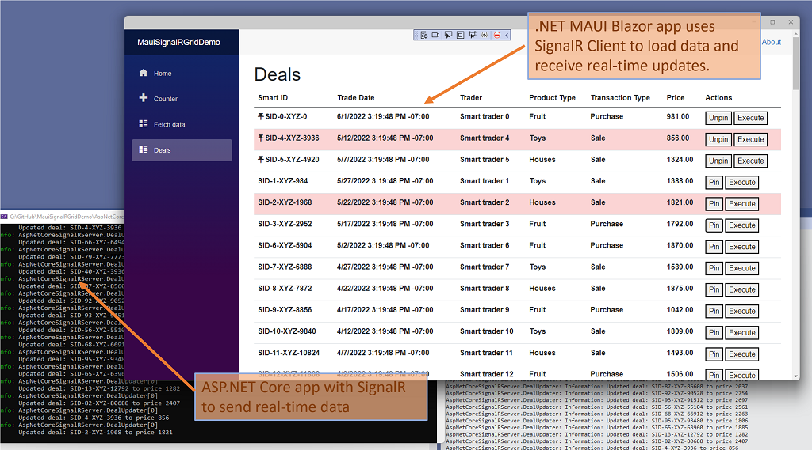

# .NET MAUI + Blazor + SignalR demo

This app shows combining .NET MAUI, Blazor, and SignalR, to build a native client app that receives real-time updates from a server.

## The server

* Built using ASP.NET Core and SignalR
* Has a list of 50 randomly-generated "deals" with various bits of data about them
* Every 0.5 seconds it randomly updates a deal's price and sends that to clients using SignalR

## The client

* Built using .NET MAUI and Blazor, and can run on Windows, macOS, Android, and iOS/iPadOS (note that the current app was tested only on Windows, and would need to be updated to point to a different URL, so it won't work out-of-the-box on non-Windows)
* Uses Blazor to render the UI using HTML/CSS, but entirely coded in C#
* Uses SignalR client to load the initial list of deals, and also to receive real-time updates about updated deals
* Highlights in red which deals were updated in the last 5 seconds
* Can pin/unpin deals to the top of the list
* Can "Execute" a deal, which just shows a native pop-up dialog (doesn't really do anything)
